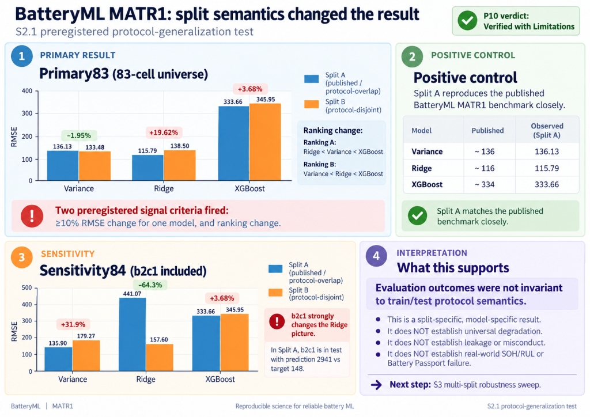

# BatteryML protocol generalization — S2.1 Kaggle (Execution Repair)

This repository is the preregistration and evidence index for `batteryml-protocol-generalization-s2.1-kaggle`, an execution-repair instance of the BatteryML MATR1 protocol-generalization experiment.

Status: **RATIFIED / CLOSED — Verified with Limitations**  
Final Evidence HEAD: [`dbb142e77901cb5ee245c98af3b42e3d407c32a5`](https://github.com/VolMax-Studio/batteryml-protocol-generalization-s2-kaggle/commit/dbb142e77901cb5ee245c98af3b42e3d407c32a5)  
Operator / Final Ratifier: Ivan Nestorov  

---

## Executive Summary & Ratified Findings

We preregistered a test of whether a BatteryML MATR1 benchmark result remains unchanged when evaluation moves from a protocol-overlapping split to an exact-size protocol-disjoint split.

We held the 83-cell universe, BatteryML pipeline, models, and metrics fixed, changing only the train/test split semantics under a preregistered minimum-change rule.

### 1. Primary 83-cell result
- **Ridge RMSE**: **`115.79 → 138.50` (+19.6%)**
- **Variance RMSE**: **`136.13 → 133.48` (−1.95%)**
- **XGBoost RMSE**: **`333.66 → 345.95` (+3.68%)**

The model ranking also changed:
- **Split A (published / protocol-overlap)**: `Ridge < Variance < XGBoost`
- **Split B (protocol-disjoint)**: `Variance < Ridge < XGBoost`

Two preregistered signal criteria fired: at least one model changed by ≥10% RMSE, and the model ranking changed. The preregistered adjudication outcome is **`SIGNAL_POSITIVE_MODEL_GATE`**.

### 2. Positive control
The overlapping Split A reproduced the published BatteryML MATR1 benchmark closely:
- **Variance**: published `~136` vs observed **`136.13`**
- **Ridge**: published `~116` vs observed **`115.79`**
- **XGBoost**: published `~334` vs observed **`333.66`**

This confirms that the BatteryML pipeline reproduces the published baseline prior to altering split semantics.

### 3. Sensitivity analysis (84 cells, `b2c1` included)
Adding cell `b2c1` changes the picture substantially:
- **Ridge RMSE**: **`441.07 → 157.60` (−64.3%)**
- **Variance RMSE**: **`135.90 → 179.27` (+31.9%)**
- **XGBoost RMSE**: **`333.59 → 319.04` (−4.36%)**

For Ridge, this reversal is heavily driven by `b2c1`: under Split A it is in the test set, with a prediction of ~2941 against a target of 148. Removing that single cell returns Ridge A test RMSE to approximately **115.79**.

Consequently, the result is **not** that protocol-disjoint evaluation universally degrades BatteryML models.

### 4. Interpretation boundary
> **Under a preregistered exact-size protocol-disjoint MATR1 split, evaluation outcomes were not invariant to split semantics: Ridge RMSE increased by 19.6% and the model ranking changed, while Variance and XGBoost showed smaller and opposite-direction effects. The result is specific to the preregistered split and tested population and does not establish universal degradation, leakage, or real-world SOH/RUL failure.**

This study does **not** establish:
- universal degradation of BatteryML models under protocol-disjoint evaluation;
- data leakage, methodological error, or researcher misconduct;
- robustness of the effect across the whole space of possible protocol-disjoint splits;
- direct applicability to real-world battery state-of-health (SOH), remaining useful life (RUL), or Battery Passport claims without field validation.

---

## Independent Verification & Evidence Record

- **L1 Independent Verification**: All 12 runs were recomputed from the published [`per-cell-predictions.csv`](s2_1-execution-output/s2-artifact/results/) files. Independently calculated RMSE and MAE match [`adjudication.json`](s2_1-execution-output/s2-artifact/adjudication.json) within ~1e-7 relative tolerance across all combinations of universe, split, and model.
- **Claude Gate Assessment**: Execution record classified as **`SURVIVES-REVIEW`**.
- **Non-blocking Evidence Notes**:
  - **F-1 (Ledger hash sequence in manifest)**: `artifact-files.sha256` records `attempt-ledger.json` as `696ae5e...` because the manifest was generated before the driver wrote the final `end_utc` timestamp and `GOVERNING_COMPLETE` disposition (`67633d1...`). Both hashes are documented; this is an operational artifact of execution finalization.
  - **F-2 (Kaggle API metadata semantics)**: Kaggle API `last_run_time` reflects initial container provisioning; the authoritative timeline is recorded in the runner preflight, driver start/end UTC timestamps, and git commit history.
- **Post-Run Content Binding**: Evaluated all 8 published versions of `volmax1/batteryml-protocol-generalization-s2-controls`. Version 8 uniquely reproduced the runtime canonical listing (`049963f1...`, 223 files) byte-for-byte. Documented in [`post-run-binding-receipt.json`](s2_1-execution-output/post-run-binding-receipt.json).

---

## Transition to S3 (Multi-Split Robustness Sweep)

S2.1 is formally **`CLOSED`**. The next scientific object is S3:
1. **S3 is explicitly post-S2.1 and non-blind**: S2.1 results (including the Ridge signal and sensitivity behavior) are known prior to S3 design.
2. **`b2c1` is a separate predefined sensitivity axis**: It will not be conflated with the selection of the multi-split distribution.
3. **Core objective of S3**: Measure the distribution of performance across the space of legitimate protocol-disjoint splits rather than attempting to reproduce a single point estimate.

---

## S2 Closure & Precedent
The previous instance `batteryml-protocol-generalization-s2-kaggle` deterministically aborted on Attempt 001 during child process environment admission due to `PYTHONPATH` site pollution. The Operator formally classified Attempt 001 as `PRE-SCIENTIFIC_EXECUTION_FAILURE`. S2 is formally closed and preserved under git tag [`s2-closed`](https://github.com/VolMax-Studio/batteryml-protocol-generalization-s2-kaggle/releases/tag/s2-closed) (commit `2ad8e8c`).

There is **no additional scientific exposure from S2 Attempt 001**: raw `.mat` files were hashed during preflight input verification, but never loaded into BatteryML (`load_batch` was never called). S2.1 executes the governing scientific design under a repaired driver that isolates `pip freeze` and validates module file-path provenance.

## Scope

- Primary universe: 83 cells, excluding `b2c1`.
- Sensitivity universe: 84 cells, including `b2c1`.
- Split A: BatteryML MATR1 primary assignment.
- Split B: minimum-change, exact-size, protocol-disjoint assignment.
- Models: Variance, Ridge, and XGBoost.
- Metrics: test RMSE (primary) and MAE (secondary).
- No neural models before gate adjudication.

## Prior knowledge boundary and exposure classification

Before S2 was designed, S1 had already exposed three results:

| S1 result | RMSE | MAE | Exposure status |
|---|---:|---:|---|
| Variance A | 136.1296 | 109.0649 | exposed |
| Variance B | 133.4759 | 109.7309 | exposed (relative change −1.95%, RMSE_B < RMSE_A) |
| Ridge A | 115.7892 | 80.4132 | exposed |
| Ridge B | unverified | unverified | exposure: unverified |
| XGBoost A | unverified | unverified | exposure: unverified |
| XGBoost B | unverified | unverified | exposure: unverified |

Cross-environment relative tolerance is frozen at **1.0%**. Observed S2.1 results matched exposed S1 results within 1.22e-07 relative error (well within tolerance).

Trigger 3 is pre-exposed and carries no independent confirmatory weight because S1 already established Variance B < Variance A. Triggers 1 and 2 derive their decision weight exclusively from unverified models.

## Receipts and frozen artifacts

- `PREREGISTRATION.md` — governing S2.1 design candidate (SHA-256: `6b027e74...`).
- `PREREGISTRATION_DIFF.md` — unified diff against S2 (`2ad8e8c`) proving zero scientific lines changed.
- `FAILURES.md` — S2 Attempt 001 failure documentation and Operator verbatim ratification statement.
- `s2_kaggle_driver.py` — fail-closed execution driver with isolated `pip freeze` and module path verification (SHA-256: `c943e1d5...`).
- `runners/kaggle-s2-execution/execute.py` — fail-closed Kaggle CPU execution runner (SHA-256: `fd74df3b...`).
- `batteryml-protocol-generalization-split-manifest.csv` — frozen assignments (SHA-256: `96695e53...`).
- `smoke-test-receipt.json` — pre-ratification Kaggle CPU smoke test PASS receipt.
- `exposure-receipt.json` — frozen prior knowledge boundary and trigger classifications.
- `attempt-policy-receipt.json` — attempt policy requiring formal Operator classification for Attempt 002 (SHA-256: `d84b322a...`).
- `determinism-receipt.json` — pre-run synthetic fixture determinism verification (`rename -> rerun -> byte-identical match`).
- `l0-provenance-receipt.json` — official TRI/MATR CC BY 4.0 provenance and licensing receipt.
- `environment-resource-receipt.json` — hardware admission (exact 4 CPUs, cgroup limit tracking, frozen XGBoost parameters).
- `post-run-binding-feasibility-receipt.json` — pre-run proof that explicit Kaggle dataset versions can be downloaded and matched.
- `s2_1-execution-output/post-run-binding-receipt.json` — post-run content binding receipt matching version 8 byte-for-byte.
- `s2_1-execution-output/s2-artifact/completion-receipt.json` — execution completion receipt (`SIGNAL_POSITIVE_MODEL_GATE`).
- `s2_1-execution-output/s2-artifact/adjudication.json` — complete adjudication output.
- `s2_1-execution-output/s2-artifact/attempt-ledger.json` — immutable attempt ledger (`GOVERNING_COMPLETE`).
- `s2_1-execution-output/public-evidence-files.sha256` — manifest of 96 public evidence files verified without deviation.

Raw HDF5 inputs, private Kaggle dataset material, credentials, and S1 local scratch data are intentionally excluded from this public repository. S2.1 reads the raw files from Kaggle dataset `rickandjoe/mit-battery-degradation-dataset` read-only; independent hash probing established byte identity with verified MATR source files before ratification.

Code: Microsoft BatteryML, MIT License.  
Data: MATR / Severson et al. (2019), CC BY 4.0.
